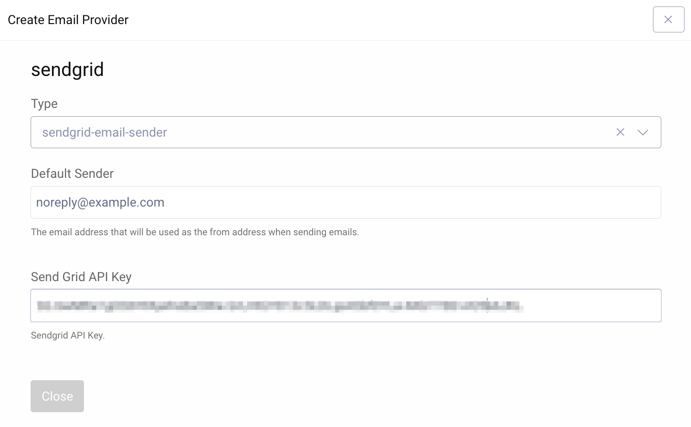

Twilio SendGrid Email Sender Plugin
=============================================

.. image:: https://img.shields.io/badge/quality-demo-red
   :target: https://curity.io/resources/code-examples/status/
   :alt: Quality

.. image:: https://img.shields.io/badge/availability-source-blue
   :target: https://curity.io/resources/code-examples/status/
   :alt: Availability

A custom Twilio `SendGrid`_ Email Sender plugin for the Curity Identity Server.

Building the Plugin
~~~~~~~~~~~~~~~~~~~

You can build the plugin by issuing the command ``mvn package``. This will produce a JAR file along with the needed dependencies in the ``target`` directory,
which can be installed.

Installing the Plugin
~~~~~~~~~~~~~~~~~~~~~

To install the plugin, copy the compiled JAR (and all of its dependencies) into the :file:`${IDSVR_HOME}/usr/share/plugins/${pluginGroup}`
on each node, including the admin node. For more information about installing plugins, refer to `curity.io/plugins`_.

Required Dependencies
"""""""""""""""""""""

For a list of the dependencies and their versions, run ``mvn dependency:list``. Ensure that all of these are installed in
the plugin group; otherwise, they will not be accessible to this plug-in and run-time errors will result.

Configuration
"""""""""""""
The plugin only takes two configuration parameters:

- Default Sender - A SendGrid registered email address that is allowed to send emails.
- Send Grid API Key - A SendGrid API key for the plugin to authenticate against the SendGrid API.

More Information
~~~~~~~~~~~~~~~~

Please visit `curity.io`_ for more information about the Curity Identity Server.

.. _curity.io/plugins: https://support.curity.io/docs/latest/developer-guide/plugins/index.html#plugin-installation
.. _curity.io: https://curity.io/
.. _SendGrid: https://www.twilio.com/sendgrid/email-api
